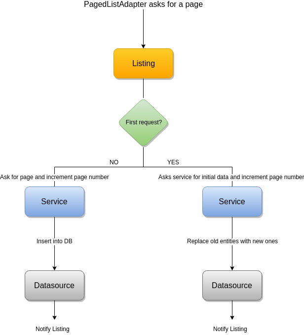

Fountain is an Android Kotlin library conceived to make your life easier when dealing with **paged** endpoint **services**, where the paging is based on incremental page numbers (e.g. 1, 2, 3, ...).
It uses the [Google Android Architecture Components](https://developer.android.com/topic/libraries/architecture/), mainly the [Android Paging Library] to make it easier to work with paged services.

The main goal of the library is to provide a [Listing](Listing.md) component from a common service specification, where the paginated strategy is based on an incremental page number.
It provides an awesome way of displaying the paged entity list and reflecting the network state in the UI.
If you use this library, you can create an MVVM architecture app and combine it with the repository pattern.
If you get a repository which provides a [`Listing`] component of each paged list, you will be creating a robuster app.

It also provides two ways to go: a mode with **network** support and a mode with **network + cache** support. 

The strategy you choose will depend on your problem.
To create the [`Listing`] you have to invoke one of the static factory methods in the [`Fountain`] singleton object.

## **Network Support** 

It provides a [`Listing`](Listing.md) structure based on a [Retrofit](http://square.github.io/retrofit/) and [RxJava](https://github.com/ReactiveX/RxJava) service.
Note that the entities aren't saved anywhere.

To use this feature you have to provide a [`NetworkDataSourceAdapter<out ListResponse<Value>>`](NetworkDataSourceAdapter.md) to the Listing constructor. 
The library will use it to handle the paging.

```kotlin
Fountain.createNetworkListing(networkDataSourceAdapter)
```

Additionally, there are some optional parameters that you can provide to the [`Listing`] creator. These parameters are specified in the [`Fountain`] section.

## **Network + Cache Support** 

It provides a [`Listing`](Listing.md) structure with cache support using [Retrofit](http://square.github.io/retrofit/) and [RxJava](https://github.com/ReactiveX/RxJava) for the service layer and a [`DataSource`] for caching the data.

```kotlin
Fountain.createNetworkWithCacheSupportListing(
  networkDataSourceAdapter = networkDataSourceAdapter,
  cachedDataSourceAdapter = cachedDataSourceAdapter
)

```
There are two required components

1. A [`NetworkDataSourceAdapter<out ListResponse<Value>>`](NetworkDataSourceAdapter.md) to fetch all pages.
1. A [`CachedDataSourceAdapter<Value>`](CachedDataSourceAdapter.md) to update the [`DataSource`].
It's the interface that the library will use to take control of the [`DataSource`].

As in the previous way, there are some optional parameters that you can specify in the [`Listing`](Listing.md) creator.

### Caching strategy
The pagination strategy that is using **Fountain** can be seen in the following image:
<br> <br> <p align="center">  </p>

The paging strategy starts with an initial service data request.
By default the initial data requested is three pages, but this value can be changed, in the [`PagedList.Config`](https://developer.android.com/reference/android/arch/paging/PagedList.Config.html), using the [`setInitialLoadSizeHint`](https://developer.android.com/reference/android/arch/paging/PagedList.Config.html#initialLoadSizeHint) method.
This parameter can be set in the [`Fountain`](Listing.md) factory method. 
When the service data comes, all data is refreshed in the [`DataSource`] using the [`CachedDataSourceAdapter`].
Note that the [`Listing`](Listing.md) component will notify that the data changed.

After that, the [Android Paging Library] will require pages when the local data is running low.
When a new page is required, the paging library will invoke a new service call, and will use the [`CachedDataSourceAdapter`] to save the returned data into the [`DataSource`].


## Architecture recommendations

It's strongly recommended to integrate this component in a MVVM architecture combined with the Repository Pattern.
The [`Listing`] component should be provided by the repository.
The `ViewModel`, can use the different [`Listing`] elements, provided by the repository, to show the data and the network changes in the UI.

[Android Paging Library]: https://developer.android.com/topic/libraries/architecture/paging/
[`CachedDataSourceAdapter`]: CachedDataSourceAdapter.md
[`DataSource`]: https://developer.android.com/reference/android/arch/paging/DataSource
[`Fountain`]: Fountain.md
[`Listing`]: Listing.md
